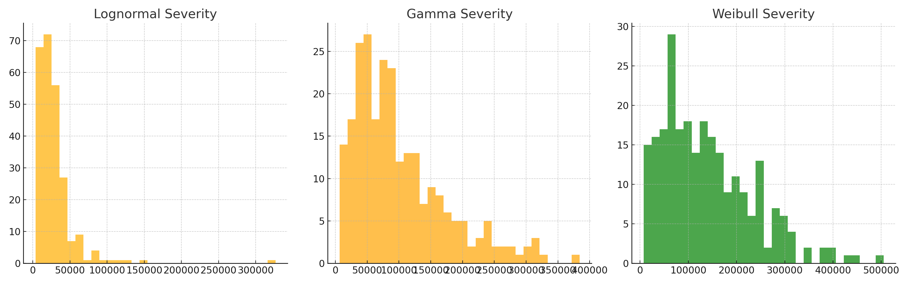
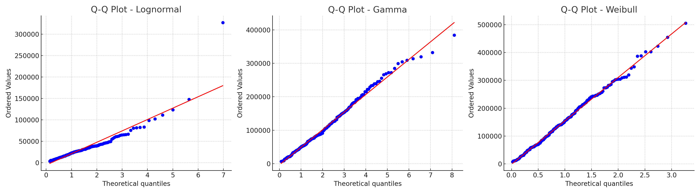
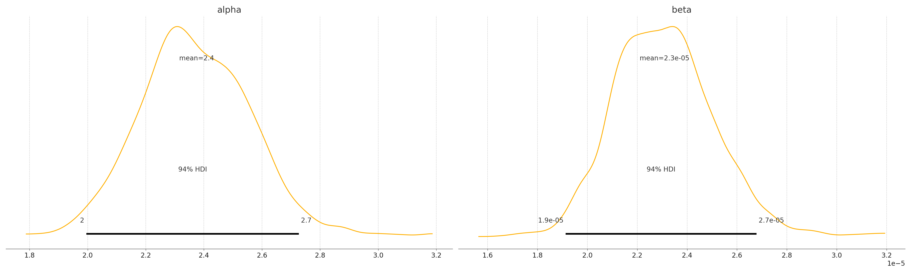
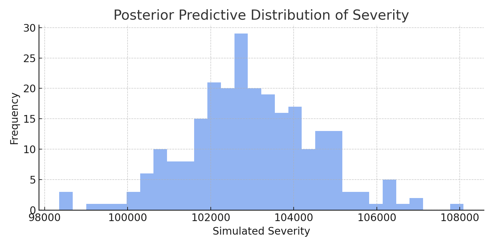

# Real-World Application: D&O Insurance Claims Modeling

I worked on a modeling project for Directors & Officers (D&O) insurance claims. This required applying principles from probability, statistical distributions, and expected value modeling to support business decisions around risk and pricing.

## 🔄 Workflow Overview

1. **Historical Loss Adjustment**  
   We trended historical claims using CPI inflation adjustments to normalize values across years.

2. **Claim Probability Estimation**  
   We estimated the probability that a company would file a claim, modeled as a Bernoulli distribution. For example:
   - `P(claim) ≈ 0.25`

3. **Loss Severity Distribution Modeling**  
   For companies with claims, we fit various statistical distributions to model claim size:

   - **Lognormal Distribution**
   - **Gamma Distribution**
   - **Weibull Distribution**

4. **Expected Loss Calculation**  
   The expected loss was calculated as:

   \[
   \text{Expected Loss} = P(\text{Claim}) \times \mathbb{E}[\text{Severity}]
   \]

---

## 📊 Histogram of Simulated Claim Severities



---

## 📈 Q-Q Plots for Distribution Fit

Used to visually assess goodness-of-fit of each distribution.



---

## 📋 Expected Loss Comparison Table

| Distribution | Expected Loss |
|--------------|----------------|
| Lognormal    | $7,537 |
| Gamma        | $24,825 |
| Weibull      | $33,576 |

---

## 🔍 Summary of Statistical Concepts Used

- Probability theory (Bernoulli process)
- Distribution fitting (Lognormal, Gamma, Weibull)
- Goodness-of-fit analysis (visual Q-Q plots)
- Expected value calculation
- Inflation-adjusted normalization (CPI trend)

This project directly leveraged foundational statistics, making it a perfect real-world example of the power of probability and distribution modeling in the insurance industry.


---

## ✅ Goodness-of-Fit: Kolmogorov-Smirnov Test

We evaluated the fit of each distribution using the **Kolmogorov-Smirnov (KS) test**. The lower the KS statistic and the higher the p-value, the better the distribution fits the data.

| Distribution | KS Statistic | p-value |
|--------------|--------------|---------|
| Lognormal    | 0.04278     | 0.74874 |
| Gamma        | 0.03691     | 0.88279 |
| Weibull      | 0.03166     | 0.96158 |

➡️ **Weibull** provided the best fit to our data, showing the lowest KS statistic and highest p-value.


---


---

## 🧠 Bayesian Distribution Fitting Extension

In addition to classical distribution fitting, we extended our analysis using **Bayesian inference** to model D&O insurance claim severities. This approach allowed us to not only estimate point values for parameters but also to quantify **uncertainty** around them.

### 🧮 Why Use Bayesian Methods?

Bayesian modeling has several advantages in the insurance domain:

- **Flexibility**: We can specify any prior knowledge about the claim distribution's shape and update it based on observed data.
- **Uncertainty Quantification**: Posteriors provide full probability distributions for parameters instead of single estimates.
- **Small Sample Resilience**: Particularly helpful when data is sparse, skewed, or heavy-tailed.

### 📐 Implementation Overview

We used **Approximate Bayesian Computation (ABC)** to estimate parameters for loss distributions such as Gamma and Weibull:

- Defined priors for parameters like shape and scale:
  - Gamma(α, β), Weibull(λ, k)
- Generated synthetic samples using candidate parameters
- Computed distances between empirical and synthetic summaries (e.g., quantiles, means)
- Accepted parameters with the closest fit, iterating to build posterior distributions

This method was particularly inspired by:

> **Goffard, P.-O., & Laub, P. J. (2020)**. *Approximate Bayesian Computations to fit and compare insurance loss models*.  
> [https://arxiv.org/abs/2007.03833](https://arxiv.org/abs/2007.03833)

### 📈 Practical Use

The posterior predictive distributions were used to:
- Simulate **future losses** with uncertainty bands
- Generate **credible intervals** for expected loss
- Guide **model comparison** with Bayes factors or posterior log-likelihoods


### 🆚 Bayesian vs. Classical (Frequentist) Approach

| Feature                  | Classical (Frequentist)                      | Bayesian                                           |
|--------------------------|----------------------------------------------|----------------------------------------------------|
| **Model Output**         | Point estimates and confidence intervals     | Full posterior distributions                       |
| **Interpretation**       | Probability is long-run frequency            | Probability expresses belief/uncertainty           |
| **Uncertainty**          | Confidence intervals around point estimates | Credible intervals from posterior distributions    |
| **Incorporates Priors**  | No                                           | Yes, through prior distributions                   |
| **Flexibility**          | Limited to parametric forms, assumptions     | Can incorporate domain knowledge and be nonparametric |
| **Parameter Estimation** | Via MLE or method of moments                 | Via Bayes’ Rule using observed data                |

**Example**:  
When fitting a Gamma distribution to model claim severities:
- The classical approach uses maximum likelihood to estimate shape and scale parameters, yielding point estimates and standard errors.
- The Bayesian approach defines priors for shape and scale, then uses observed data to update these beliefs, resulting in full posterior distributions.

This allowed us to produce more nuanced forecasts of extreme loss events—especially important when working with small or skewed insurance datasets where frequentist assumptions may fail.

---

---

## 📊 Bayesian Model Output

### 📌 Posterior Distributions for Parameters

These show the uncertainty in our estimates of the Gamma distribution’s shape (`alpha`) and rate (`beta`) parameters.



### 📌 Posterior Predictive Distribution

This histogram shows simulated claim severities drawn from the Bayesian model. It reflects both the data and the prior assumptions.




> 💡 **Bayesian Inference — Normal Likelihood with Uniform Prior**
>
> Suppose we want to estimate the mean μ of a Normal distribution. We assume the **variance is known** (σ² = 1). We observe:
>
> ```
> x = 6.0
> ```
>
> ---
> ### 🔍 Step 1: Likelihood
> Our model is:
>
> ```
> x ~ Normal(μ, σ² = 1)
> ```
>
> The **likelihood function** (up to a constant) is:
>
> ```
> p(x | μ) ∝ exp( -0.5 * (x - μ)² )
> ```
>
> Plugging in our data:
>
> ```
> p(6 | μ) ∝ exp( -0.5 * (6 - μ)² )
> ```
>
> ---
> ### 🧱 Step 2: Prior — Uniform
> Suppose we have **no strong belief** about μ, except that it's between -10 and 10:
>
> ```
> μ ~ Uniform(-10, 10)
> ```
>
> So:
>
> ```
> p(μ) = constant for -10 ≤ μ ≤ 10
> ```
>
> ---
> ### 🧠 Step 3: Posterior ∝ Likelihood × Prior
>
> Since the prior is uniform, the **posterior is proportional to the likelihood** within the bounds:
>
> ```
> p(μ | x=6) ∝ exp( -0.5 * (6 - μ)² )  for μ ∈ [-10, 10]
> ```
>
> This is just a **truncated Normal distribution** centered at 6:
>
> - It looks like a bell curve
> - It is zero outside [-10, 10]
>
> ---
> ### ✅ Result
> - Our updated belief about μ is concentrated around 6
> - It declines symmetrically as we move away
> - The prior only serves to **clip** the posterior to the allowed region
>
> This is a simple case where the posterior shape is **entirely driven by the likelihood**, and the uniform prior only sets the boundaries.
> 

## 🧠 Why Use Bayesian Methods?

Bayesian statistics offers several key advantages over classical (frequentist) methods, especially in real-world applications:

---

### ✅ 1. Incorporates Prior Knowledge
You can include domain expertise, historical data, or expert opinion directly into your model.

**Example:**  
In medical trials, previous studies on similar drugs can be used to form priors on treatment effect, reducing the sample size needed.

---

### ✅ 2. Produces Full Distributions (Not Just Point Estimates)
Bayesian models return **posterior distributions**, giving you a full picture of uncertainty instead of just single values and standard errors.

**Example:**  
In insurance, rather than saying "expected loss = \$100,000", a Bayesian model can provide a full distribution of possible losses with credible intervals.

---

### ✅ 3. Works Well with Small or Noisy Data
Bayesian methods "shrink" estimates sensibly when data is limited, avoiding overfitting.

**Example:**  
Startups predicting churn or revenue with very few users can use informative priors to stabilize predictions.

---

### ✅ 4. Natural Framework for Hierarchical Models
Bayesian inference makes it easy to build models with nested structure (e.g., data grouped by country, store, or patient).

**Example:**  
Modeling test scores across schools with shared effects — Bayesian models pool information across similar schools.

---

### ✅ 5. Posterior Predictive Checks & Model Comparison
You can simulate new data from your fitted model and compare it to the real data, or use Bayes Factors to compare models.

**Example:**  
In manufacturing quality control, you can predict the distribution of defect counts and compare that to observed output.

---

### ✅ 6. Intuitive Probabilistic Interpretation
Bayesian results are easier to explain:  
> "There’s a 95% probability that the parameter lies in this range"

Compared to frequentist:
> "95% of such intervals would contain the parameter if we repeated this experiment forever"

**Example:**  
When presenting results to non-technical stakeholders, Bayesian intervals feel more natural and actionable.

---

### ✅ 7. Better Handling of Missing Data
Bayesian methods can model the missing data mechanism directly and impute values as part of inference.

**Example:**  
In survey data, where some responses are missing, Bayesian models can estimate the missing values along with model parameters.

---

### ☀️ Bonus Example: The Sunrise Problem

The **frequentist approach** struggles with questions like:

> "What is the probability that the sun will rise tomorrow?"

A frequentist might respond:

> "That question doesn’t make sense — the sun either will or won’t rise. We can't assign a probability to a unique, non-repeatable event."

In frequentist statistics, probabilities are defined as the long-run frequency of events in repeated trials. Since we can’t repeat “tomorrow” under identical conditions, the frequentist approach can’t give a meaningful answer.

If we tried to model this using frequentist tools, we might represent each day as a **Bernoulli random variable**, where a value of 1 means the sun rose. After 10,000 days — all with value 1 — the frequentist estimate of the probability of sunrise is:

```
P(sunrise) = number of successes / number of trials = 10,000 / 10,000 = 1.0
```

That gives us a **100% probability**, implying absolute certainty — no room for doubt or unknowns. But we know from a practical standpoint that catastrophic events *could* prevent the sun from rising. So this model is overconfident and inflexible.

In contrast, the **Bayesian approach** handles this naturally.

We can still model each sunrise as a Bernoulli trial, but now we introduce a **prior belief** — for example, a Beta distribution, such as `Beta(1, 1)` (a uniform prior). After observing 10,000 sunrises, our **posterior distribution** becomes `Beta(10,001, 1)`. From this, we can compute:

```
P(sunrise tomorrow) = 10,001 / (10,001 + 1) ≈ 0.9999
```

So instead of blindly saying “100%,” we now have a probability that reflects strong confidence *with a sliver of uncertainty* — which matches how real-world reasoning works.

This is one of the key strengths of the Bayesian approach:  
It allows us to quantify uncertainty, even for events that occur only once.

